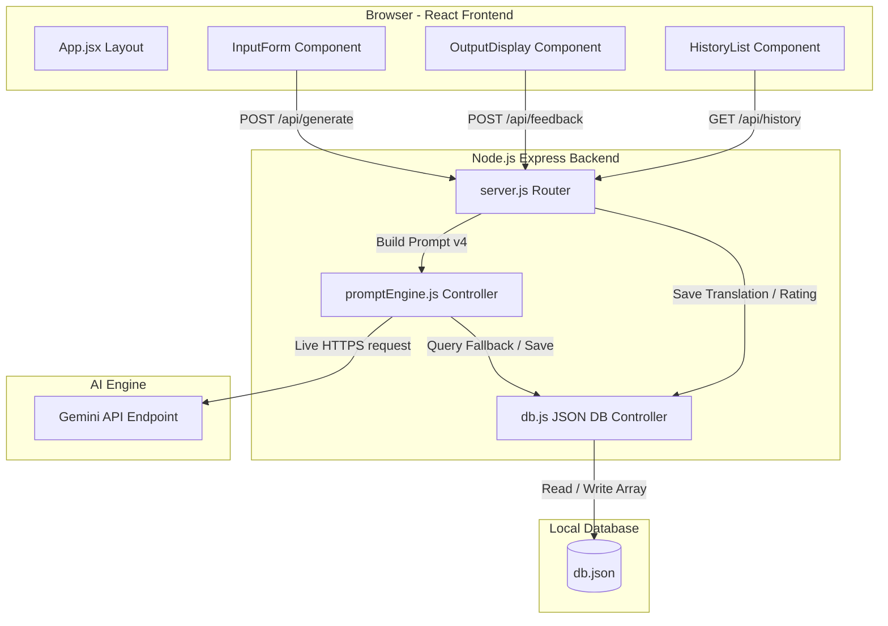

# System Architecture & Data Flow

This document details the software architecture and component relationships for the **AI Localisation & Regional Language Adaptation Assistant**.

---

## 1. System Architecture Diagram

---

## 2. Key Component Responsibilities

### A. Frontend Layer (React + Vite)
* **[App.jsx](file:///c:/Users/varanasi%20saivinay/OneDrive/Desktop/project/frontend/src/App.jsx)**: Orchestrates global states (active translation output, loading spinner, connection error banners, and active history selection ID) and handles API routing fetch logic.
* **[InputForm.jsx](file:///c:/Users/varanasi%20saivinay/OneDrive/Desktop/project/frontend/src/components/InputForm.jsx)**: Captures user selections (`Journalist`, `Inputs`, `English`, `Tone`, `Dialect`), implements client-side form validation, and features autocomplete story presets.
* **[OutputDisplay.jsx](file:///c:/Users/varanasi%20saivinay/OneDrive/Desktop/project/frontend/src/components/OutputDisplay.jsx)**: Displays Telugu translations alongside cultural editor notes. Provides action buttons to copy, download as TXT/PDF, share, rate 1-5 stars, or request an alternative regeneration.
* **[HistoryList.jsx](file:///c:/Users/varanasi%20saivinay/OneDrive/Desktop/project/frontend/src/components/HistoryList.jsx)**: Lists previous translation summaries sorted newest-first, allowing editors to retrieve past records instantly.

### B. Backend Layer (Express.js)
* **[server.js](file:///c:/Users/varanasi%20saivinay/OneDrive/Desktop/project/backend/server.js)**: Configures HTTP ports, CORS permissions, body payload size limits, and serves REST endpoints:
  - `GET /`: API welcome and schema.
  - `GET /api/health`: Server heartbeats.
  - `POST /api/generate`: Assembles variables and requests translations.
  - `POST /api/feedback`: Records 1-5 star user ratings.
  - `GET /api/history`: Returns history logs.
  - `GET /api/history/:id`: Fetches a single history record.
  - `GET /api/analytics/quality`: Calculates average rating scores and usage statistics.
* **[promptEngine.js](file:///c:/Users/varanasi%20saivinay/OneDrive/Desktop/project/backend/promptEngine.js)**: Runs Prompt v4 rules, scales API temperatures for regeneration request flags, and implements fallback mock translations.
* **[db.js](file:///c:/Users/varanasi%20saivinay/OneDrive/Desktop/project/backend/db.js)**: Manages persistence of records inside the local database file [db.json](file:///c:/Users/varanasi%20saivinay/OneDrive/Desktop/project/backend/db.json).
