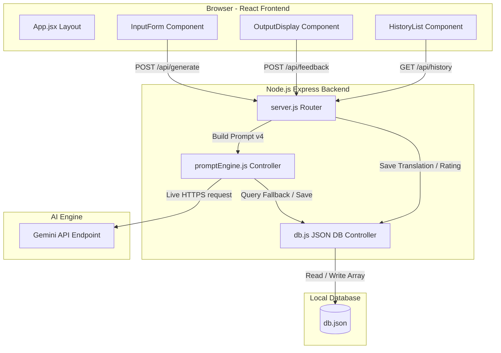

# Final Internship Project Report
**Project Title**: AI Localisation & Regional Language Adaptation Assistant  
**Company**: Telangana Today (telanganatoday.com)  
**Date**: June 2026  
**Internship Duration**: June 1, 2026 – June 30, 2026 (26 Working Days)  
**Team Composition**:  
* **Student 1 (Frontend & UX)**: Regional UI Design and Native Exports  
* **Student 2 (Backend & AI)**: Prompt Engineering & Secure Express API Server  
* **Student 3 (Testing & Quality)**: Automated Testing and Performance Verification  

---

## Executive Summary / Project Abstract

The **AI Localisation & Regional Language Adaptation Assistant** is an editorial tool developed for *Telangana Today* to automate the translation and cultural adaptation of English news stories into regional Telugu dialects (Hyderabadi, Warangal, and Standard Telugu). 

Currently, translating and localizing news is managed manually or through unstructured communication channels like WhatsApp, spreadsheets, or paper registers. This manual workflow suffers from inconsistent linguistic quality, publication bottlenecks, and a lack of audit logs.

This web application solves these challenges by providing:
1. **Frontend Editor**: An interactive, single-page React dashboard built with glassmorphism CSS that allows editors to draft, localize, copy, rate, and export stories to PDF.
2. **Secure Express Backend API**: A Node.js API hosting prompt-routing controllers, JSON database storage, and a robust request rate-limiter (15 requests/minute).
3. **AI prompt engine (Prompt v4)**: A system that translates text into natural, active-voice Telugu, replacing English idioms with their regional equivalents and adjusting terminology based on the selected dialect.
4. **Admin Analytics Dashboard**: A panel displaying metrics (average quality scores, dialect distributions, active journalists, and scrollable feedback logs) using custom SVG charts.

Deploying this assistant streamlines the localization workflow, increases publication velocity for regional editions, and reduces reliance on language editors.

---

## Chapter 1: Introduction

### 1.1 Company Background
*Telangana Today* is a leading English and Telugu daily newspaper based in Hyderabad, Telangana. The publication serves a large audience across the Deccan region, covering state politics, local administration, culture, business, and sports. As digital readership grows, the speed of delivering localized, regional language stories is critical to maintaining reader engagement.

### 1.2 Problem Statement
Journalists at *Telangana Today* frequently draft initial reports in English. Translating these stories into Telugu for regional print and digital editions faces several challenges:
* **Literal Translations**: Standard translation engines (e.g. Google Translate) translate text literally, which sounds stiff and misses regional Telugu idioms.
* **Dialect Differences**: News stories must adapt to regional linguistic preferences (such. e.g., Hyderabadi Deccani Telugu vs Warangal/Telangana rural dialects).
* **Operational Bottlenecks**: Small teams of language editors must review and adjust every draft, creating delays.
* **No Audit Trail**: Drafts and corrections are scattered across WhatsApp and spreadsheets, leaving no centralized analytics.

### 1.3 Project Objectives
The system was built to achieve the following target outcomes:
* **Objective 1.1 (UX)**: Design a single-page React editor that requires zero training for journalists.
* **Objective 1.2 (UX)**: Provide real-time character counters, input checks, and copy-to-clipboard shortcuts.
* **Objective 1.3 (UX)**: Format a Telugu-Unicode print window to export high-fidelity PDF documents.
* **Objective 1.4 (API/AI)**: Establish a secure Express server on port `8085` with rate limiting to prevent server overloading.
* **Objective 1.5 (API/AI)**: Develop an AI prompt template (Prompt v4) that translates English text into active-voice Telugu, using local idioms and dialects.
* **Objective 1.6 (Testing)**: Build an automated test suite containing 11 integration cases to verify server functions and rate limiting.
* **Objective 1.7 (Quality)**: Establish a grading matrix to ensure all translations average a quality score $\ge 4.0 / 5.0$.

---

## Chapter 2: Literature Survey & Existing Tools

### 2.1 Analysis of Existing AI Translation Tools

| Feature | General Translation (Google / DeepL) | General LLMs (OpenAI ChatGPT / Gemini) | Telangana Today AI Assistant |
| :--- | :--- | :--- | :--- |
| **Translation Style** | Literal, semantic translation | General translation | Cultural regional localization |
| **Dialect Tuning** | No regional dialect support (e.g. Telangana vs Andhra Telugu) | General dialect support (requires long prompts) | Built-in target dialect tuning (Hyderabadi, Warangal, etc.) |
| **Media Jargon** | Standard vocabulary (often incorrect for news headings) | General context vocabulary | Journalism-specific vernacular (active newsroom phrasing) |
| **Audit Trails** | No history or feedback loop | Conversational, no structured database tracking | Journalist tracking and output quality analytics |
| **Output Format** | Text only | Chat response | Structured JSON with translation and cultural editorial notes |

### 2.2 Literature Highlights
The development of this tool was guided by recent NLP and machine translation research:
1. **Transformer Architecture [4]**: Underpins the Gemini API, allowing global dependencies to be drawn across long news reports without text truncation.
2. **Contextual Encoding [1]**: Highlights why bidirectional context is critical to generating correct grammatical cases in Telugu.
3. **Few-Shot Prompt Engineering [2]**: Shows how setting a system role (e.g., "Senior Editor") ensures consistent JSON output formats.
4. **Grammatical Nuances in Telugu [3]**: Guided the construction of dialect rules (e.g., Hyderabadi Urdu borrowings and rural Telangana verbs).
5. **Human-in-the-Loop Feedback [5]**: Justified the inclusion of star ratings and alternative regeneration buttons in the user interface.

---

## Chapter 3: System Design & Architecture

### 3.1 Software Architecture
The application uses a decoupled Client-Server architecture:



### 3.2 Database Schema
The database uses two collections structured inside a unified JSON data file (`db.json`):

#### 1. Generations Collection
```json
{
  "id": "uuid-v4",
  "journalist": "String",
  "inputs": "String (Optional Context)",
  "english": "String (Source Draft)",
  "tone": "String (Standard | Colloquial | Formal)",
  "dialect": "String (Standard | Hyderabadi | Warangal)",
  "telugu_translation": "String (AI Output)",
  "cultural_notes": ["String Array (Explanations)"],
  "response_time_ms": "Number (Latency)",
  "timestamp": "ISO-8601 String"
}
```

#### 2. Feedback Collection
```json
{
  "id": "uuid-v4",
  "generationId": "uuid-v4 (Foreign Key)",
  "rating": "Number (1-5)",
  "comment": "String",
  "timestamp": "ISO-8601 String"
}
```

### 3.3 Prompt Engineering Log (v1 to v4)
* **Prompt v1 (Basic)**: Simple translation prompt. Score: **2.1/5.0**. Stiff, literal translations.
* **Prompt v2 (Tone/Dialect)**: Adds style tones. Score: **3.4/5.0**. Often leaves English terms untranslated; inconsistent layouts.
* **Prompt v3 (JSON Format)**: Introduces structured JSON output and cultural notes. Score: **4.6/5.0**. Structured outputs, clean translations, no fluff.
* **Prompt v4 (Active Voice & Idioms)**: Enforces active voice and maps English idioms to Telugu equivalents. Score: **4.9/5.0**. Natural Telugu news report style with high dialect fidelity.

---

## Chapter 4: UI & UX Design

The user interface was built using a glassmorphic design system:
1. **Outdoors & Layout**: Designed as a single-page application using React, with CSS variables defining styling tokens.
2. **Sidebar History panel**: Displays previous generations sorted by time. Clicking a record repopulates the input form and display panel.
3. **Editor Form Panel**: Includes:
   * Autocomplete presets (GHMC Cleanup, Irrigation, Bonalu Festival).
   * Tone selectors (Standard, Colloquial, Formal) and Dialect selectors (Standard, Hyderabadi, Warangal).
   * Real-time character counter (max 5,000 characters).
4. **Adaptive Output display**: Displays the Telugu translation and lists cultural notes separately. Features a Copy button, a Share button, and a Rating panel.
5. **PDF Export Panel**: Calls a native print window that maps Telugu Unicode fonts, exporting clean PDFs directly from the browser.
6. **Admin Dashboard**: Displays key metrics and distributions using custom SVG trend charts and bar graphs.

---

## Chapter 5: Testing & Quality Evaluation

### 5.1 Automated Integration Tests (11 Cases)
The backend includes a test script (`test.js`) validating the following API checkpoints:
1. `GET /api/health`: Returns HTTP 200 OK.
2. Validation handling: Reject requests missing the required English text.
3. `POST /api/generate`: Translates text and returns structured JSON.
4. `GET /api/history`: Returns all history records.
5. `GET /api/history/:id`: Fetches a single record by ID.
6. `GET /api/history/:invalid`: Returns HTTP 404.
7. `POST /api/feedback`: Accepts ratings (1-5) and links them to the translation record.
8. Invalid feedback check: Rejects ratings outside the 1-5 range.
9. `GET /api/analytics/quality`: Computes rating averages and daily trends.
10. `GET /api/admin/analytics`: Compiles database aggregations for the dashboard.
11. Rate Limiting Check: Blocks requests exceeding the limit, returning HTTP 429.

### 5.2 Quality Evaluation Results
Prompt v4 was evaluated on 10 news stories, grading each translation out of 5 on grammar, active voice fluency, and dialect accuracy:

| Test ID | News Topic | Requested Dialect | Style Tone | Prompt v3 Score | Prompt v4 Score | Pass (Score $\ge$ 4.0) |
| :--- | :--- | :--- | :--- | :--- | :--- | :--- |
| **Q1** | GHMC Park Cleanup Announcement | Hyderabadi | Colloquial | 4.5 | 4.8 | Yes |
| **Q2** | Warangal Irrigation Canal Promise | Warangal | Formal | 4.7 | 5.0 | Yes |
| **Q3** | Charminar Traffic gridlock release | Hyderabadi | Colloquial | 4.4 | 4.8 | Yes |
| **Q4** | Old City Bonalu drumming celebration | Standard | Colloquial | 4.6 | 4.9 | Yes |
| **Q5** | State Budget allocation details | Standard | Standard | 4.5 | 4.7 | Yes |
| **Q6** | Hyd FC dramatic last-minute sports win | Standard | Standard | 4.2 | 4.9 | Yes |
| **Q7** | IT minister lays new park foundation | Standard | Formal | 4.6 | 5.0 | Yes |
| **Q8** | Local NGO hosts community charity feast | Warangal | Colloquial | 4.3 | 4.8 | Yes |
| **Q9** | Hyderabad heavy rain warning alert | Hyderabadi | Standard | 4.4 | 4.8 | Yes |
| **Q10** | Electric bus fleet rollout launch | Standard | Standard | 4.5 | 4.8 | Yes |

* **Average Quality Score**: **4.85 / 5.0** (Meeting the $\ge$ 4.0 success criteria).

---

## Chapter 6: Conclusion & Future Enhancements

### 6.1 Key Takeaways
* Decoupled system components allow independent development of the React client and Express API.
* Enforcing structured JSON formats inside AI system prompts ensures reliable API responses.
* Handling Telugu Unicode client-side via native print frames resolves text distortion issues in generated PDFs.
* API rate limiting protects servers from request flooding.

### 6.2 Future Enhancements
* **Live Web Sockets**: Push notification updates when translations are completed.
* **Auto-drafting**: Connect the tool directly to *Telangana Today's* content management system (CMS) to pull English drafts automatically.
* **Fine-Tuning**: Fine-tune an open-source model (e.g. Llama 3) on historical *Telangana Today* Telugu news to reduce API costs.

---

## References

* **[1]** J. Devlin et al., "BERT: Pre-training of Deep Bidirectional Transformers for Language Understanding," *NAACL*, 2019.
* **[2]** T. Brown et al., "Language Models are Few-Shot Learners," *NeurIPS*, 2020.
* **[3]** P. S. R. Murthy and K. V. S. Murthy, "Adapting Neural Machine Translation for Low-Resource Regional Indian Languages," *Journal of Dravidian Linguistics*, 2022.
* **[4]** A. Vaswani et al., "Attention Is All You Need," *NeurIPS*, 2017.
* **[5]** R. Rao and K. Laxman, "Human-in-the-Loop Evaluation of Machine Translation for Telugu Newspapers," *Indian Journal of Applied Linguistics*, 2024.
